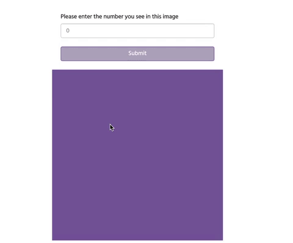

<div align="center">
     <h1>Vision-Cognition: A Tool to Measure Human Occlusion Reasoning. </h1>  
.<br>    
</div>

By Junior Garcia, Mohammad M. Ghassemi, Tuka Alhanai 

**Vision-Cognition** is a data-collection tool I developed during my Undergraduate Research Assistantship for the [Laboratory for Computer-Human Intelligence](https://x-labs.xyz/) at New York University Abu Dhabi, led by [Professor Tuka Alhanai](https://talhanai.xyz/). This tool is still under-development at the Lab and this repository contains my contributions, which is the creation of a ready-to-ship, customizable prototype written primarily in Python(Flask), Javascript(p5.js), and MySQL.


## Abstract
Advances in image occlusion reasoning imitate human visual perception strategies. Here, we introduce a flexible open-source tool that captures human visual perception strategies during image recognition tasks without the need for specialized equipment (e.g. eye-trackers). Our tool tracks participants as they sequentially reveal image segments using an ‘eraser’- like interaction until the participant feels confident about the identity of the hidden image. By recording participant cursor movement and revelation choices for investigator defined images, eraser sizes, and user scoring systems, our tool enables the study of visual perception strategies for a variety of tasks. To evaluate the tool, we deployed a digit recognition experiment with 500 participants. We found that participant accuracy, task duration, and occlusion coverage for digit classification varied with eraser resolution. The tool may be customized for various cursor tracking and occlusion canvas resolutions, and custom balances of class outcome labels while controlling for confounding factors.

## Repository Content: 

This repository contains the source code presented for Vision-Cognition. The following is a more descriptive breakdown of the repository's contents: 
 - ```crowd_sourcing/```   
 Contains the auxiliary python scripts used to deploy and monitor Vision-Cognition's Human Intelligence Task on Amazon Mechanical Turk. 
- ```data_analysis/```   
Contains the collected data from the user study presented in our paper as well as the Jupyter Notebooks used to clean, analyze, and visualize such collected data. 
- ```ioiapp_src/```   
Contains the source code for Vision Cognition as well instructions on how to run it locally. 

- ```db_backups/```              
Contains a bash script to create a sql dump from the mysql database and a python script to create csv files from the my sql dump. 


